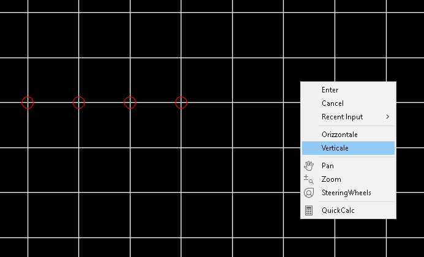
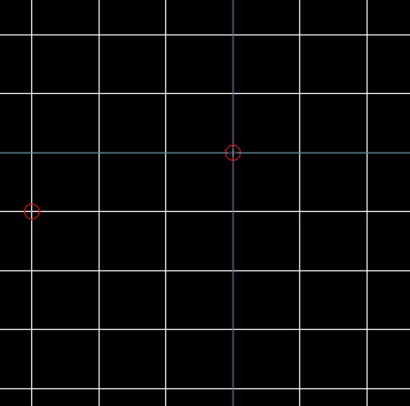

# MULTIBREAKATPOINT for AutoCAD 
[](https://opensource.org/licenses/MIT)


> Un'utility AutoCAD che estende il comando nativo `_BREAKATPOINT` per dividere linee in multipli segmenti usando linee di intersezione

## 💡 Vantaggi rispetto a _BREAKATPOINT

MULTIBREAK è un'evoluzione avanzata del comando nativo AutoCAD `_BREAKATPOINT`:

- **_BREAKATPOINT**: richiede di lanciare il comando per ogni singolo punto di divisione
- **MULTIBREAKATPOINT**: permette di dividere una linea in più punti con una singola esecuzione del comando

Questo si traduce in:
- Maggiore efficienza nel workflow
- Riduzione significativa dei tempi di esecuzione
- Minor rischio di errori nelle operazioni ripetitive

## 🚀 Caratteristiche Principali

- Divide linee orizzontali o verticali in più segmenti
- Crea automaticamente punti di riferimento
- Gestione automatica dei layer
- Supporto completo per lo snap ad intersezione
- Interfaccia utente intuitiva
- Esecuzione multipla con un singolo comando

## 📋 Prerequisiti

- AutoCAD (versione 2018 o superiore)
- Permessi di scrittura nella cartella degli script di AutoCAD

## 💻 Installazione

1. Scarica il file `multibreakatpoint.lsp`
2. In AutoCAD, digita `APPLOAD` nella riga di comando
3. Naviga fino alla posizione del file scaricato
4. Seleziona il file e clicca "Load"

Per il caricamento automatico, copia il file nella cartella di supporto di AutoCAD.

## 🔨 Utilizzo

```lisp
Command: MULTIBREAK
Seleziona tipo (Orizzontale/Verticale): H
Seleziona la linea da dividere:
Seleziona i punti di intersezione...
```

Per istruzioni dettagliate, consulta la [documentazione completa](./multibreak-documentation.md).

## 📝 Esempio

```
Prima:     |    |    |
     ------+----+----+------
           |    |    |

Dopo:      |    |    |
     ------+----+----+------
           |    |    |

(Tutti i segmenti creati con un singolo comando!)
```






## 🤝 Contribuire

Le pull request sono benvenute. Per modifiche importanti, apri prima un issue per discutere cosa vorresti cambiare.

## 📄 Licenza

[MIT](./LICENSE) © [Antonio Demarcus]

## 👤 Autore

- **Antonio Demarcus**
- Data di rilascio: Gennaio 2025
- Versione: 1.0

## 📞 Supporto

Per problemi o suggerimenti, apri un issue su GitHub o contatta l'autore.

---
⭐️ Se questo progetto ti è utile, metti una stella su GitHub!
