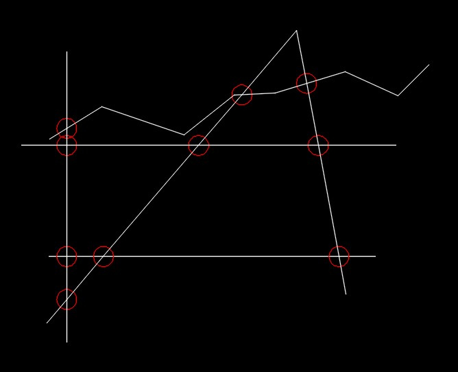

# MULTIBREAKATPOINT - V2.0 for AutoCAD 
[](https://opensource.org/licenses/MIT)


> Un'utility AutoCAD che estende il comando nativo `_BREAK` per dividere linee e polilinee in multipli segmenti usando punti di intersezione, con supporto per qualsiasi angolazione




## 💡 Vantaggi rispetto a _BREAKATPOINT

MULTIBREAK è un'evoluzione avanzata del comando nativo AutoCAD `_BREAK`:

- **_BREAKATPOINT**: richiede di lanciare il comando per ogni singolo punto di divisione
- **MULTIBREAKATPOINT**: permette di dividere una linea in più punti con una singola esecuzione del comando

Questo si traduce in:
- Maggiore efficienza nel workflow
- Riduzione significativa dei tempi di esecuzione
- Minor rischio di errori nelle operazioni ripetitive

## 🚀 Caratteristiche Principali

- Divide linee con qualsiasi angolazione in più segmenti con un singolo comando
- Supporto completo per lo snap ad intersezione
- Creazione automatica di punti di riferimento su layer dedicato
- Gestione automatica dei layer
- Interfaccia utente intuitiva
- Esecuzione multipla senza dover rilanciare il comando

## ⚡ Vantaggi nel Workflow

- **Efficienza**: divide una linea in più punti con una singola esecuzione del comando
- **Velocità**: riduce significativamente i tempi di esecuzione rispetto all'uso di comandi multipli
- **Precisione**: supporto completo per snap ad intersezione e punti di riferimento
- **Flessibilità**: funziona con linee di qualsiasi angolazione
- **Organizzazione**: gestione automatica dei layer per i punti di riferimento

## 📋 Prerequisiti

- AutoCAD (versione 2018 o superiore)
- Permessi di scrittura nella cartella degli script di AutoCAD

## 💻 Installazione

1. Scarica il file `multibreakatpoint.lsp`
2. In AutoCAD, digita `APPLOAD` nella riga di comando
3. Naviga fino alla posizione del file scaricato
4. Seleziona il file e clicca "Load"

Per il caricamento automatico, copia il file nella cartella di supporto di AutoCAD.


## 📝 Esempio di Utilizzo

```
Prima:        \     |     /
               \    |    /
                \   |   /
                 \  |  /
                  \ | /
                   \|/

Dopo:          \    |    /
               -\   |   /-
                -\  |  /-
                 -\ | /-
                  -\|/-

(Tutti i segmenti creati con un singolo comando!)
```


## 🤝 Contribuire

Le pull request sono benvenute. Per modifiche importanti, apri prima un issue per discutere cosa vorresti cambiare.

## 📄 Licenza

[MIT](./LICENSE) © [Antonio Demarcus]

## 👤 Autore

- **Antonio Demarcus**
- Data di rilascio: 14 Gennaio 2025
- Versione: 2.0

## 📞 Supporto

Per problemi o suggerimenti, apri un issue su GitHub o contatta l'autore.

---
⭐️ Se questo progetto ti è utile, metti una stella su GitHub!
